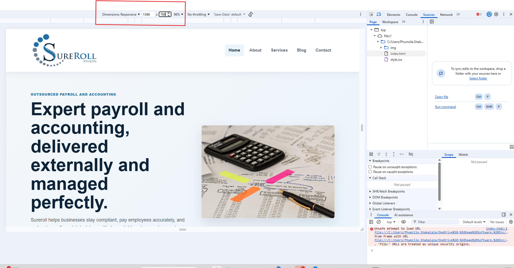
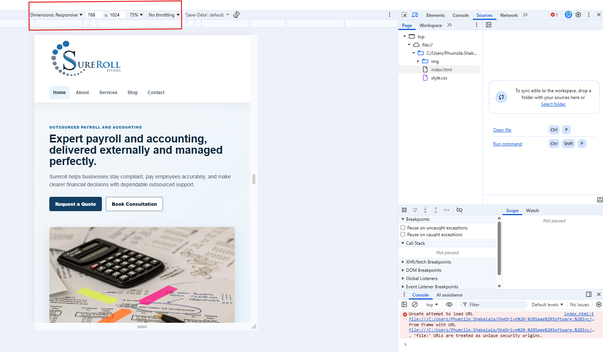
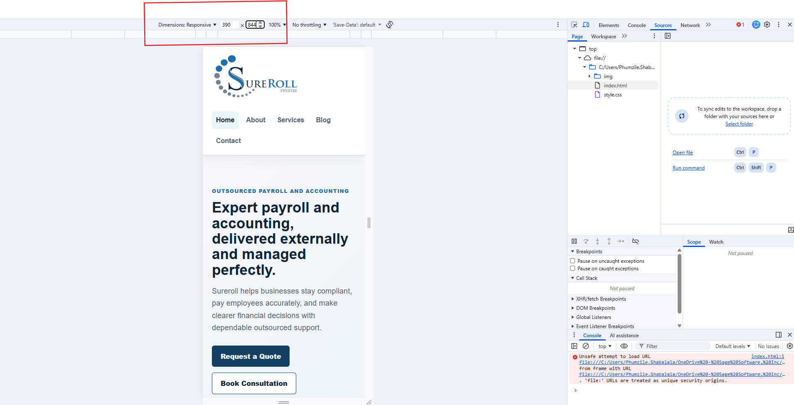

# Project Title
Website Development_ Sureroll (PTY)LTD

## Student Information
- Name: Phumzile Clementine Shabalala 
- Course: WEDE5020
- Student Number: ST10503068

## Project Overview
This project involves the design and development of a simple website using HTML. The website is intended to provide information about business services such as payroll, accounting, and financial management. It is structured to be user-friendly, informative, and easy to navigate.

## Features
- Home Page 
- Contact form
- About page
- Services Page
- Blog Page
- Simple navigation links

## Key Features and Functionality
- Home page with navigation links  
- About Us section  
- Contact page for user inquiries  
- Blog or information pages 

## Timeline and Milestones
- Phase 1: Planning and design  
- Phase 2: HTML structure development  
- Phase 3: Content creation and page linking  
- Phase 4: Testing and review  
- Phase 5: Final submission  

## Part 1 Details
Part 1 of this project focuses on creating the basic structure of the website using HTML only. This includes:
- Setting up the homepage  
- Creating navigation links  
- Building initial content pages  
- Ensuring proper layout and structure 

## Part 2 Details: CSS Styling and Responsive Design

Part 2 of this project focuses on improving the visual design of the website using an external CSS stylesheet and responsive design techniques. The website uses one shared stylesheet, `style.css`, which is linked to all five HTML pages.

The following improvements were made for Part 2:
- A consistent blue and grey colour scheme was applied across the website.
- Typography styles were added for headings, body text, buttons, and navigation links.
- CSS Grid and Flexbox were used to create structured desktop layouts.
- Reusable CSS classes were created for headers, navigation, hero sections, service cards, forms, buttons, and footers.
- Responsive breakpoints were added for tablet and mobile screen sizes.
- Images were made responsive using flexible sizing, `srcset`, and `sizes` attributes.
- The logo was updated to a larger blue version to match the website theme.
- The website was tested on desktop, tablet, and mobile screen sizes.

## Changelog

Project changes are recorded in the separate `CHANGELOG.md` file. The changelog includes entries for the original website structure, feedback-related improvements, CSS styling updates, responsive design updates, and fixed issues.
## Responsive Design Testing

The website was tested using browser developer tools to check how it displays on desktop, tablet, and mobile screen sizes.

### Devices Tested

| Device Type | Screen Size | Result |
|---|---:|---|
| Desktop | 1366 x 768 | Layout displays in multiple columns with full navigation visible. |
| Tablet | 768 x 1024 | Content adjusts and sections stack neatly where needed. |
| Mobile | 390 x 844 | Layout changes to a single-column structure and images resize correctly. |

### Screenshot Evidence

#### Desktop View

#### Tablet View

#### Mobile View

### Testing Summary

During testing, the layout, navigation, images, service cards, and contact forms were checked on different screen sizes. The website was updated to use responsive CSS, media queries, flexible grids, relative units, and responsive images so that users can view the website clearly on desktop, tablet, and mobile devices.
## References

MDN Web Docs (n.d.) *HTML: HyperText Markup Language*. Available at: https://developer.mozilla.org/en-US/docs/Web/HTML (Accessed: 19 April 2026).

W3Schools (n.d.) *HTML Tutorial*. Available at: https://www.w3schools.com/html/ (Accessed: 19 April 2026).

OpenAI (2026) *ChatGPT assistance for HTML structure and README formatting*. Available at: https://chat.openai.com (Accessed: 19 April 2026).
Afrihost (n.d.) Afrihost website. Available at: https://www.afrihost.com/ (Accessed: 9 
April 2026).  

Nathaniel Seloane (2026) Interview on company operations and website requirements. 
Personal communication, 9 April. 

Color Hunt (n.d.) Color palettes for design inspiration. Available at: https://colorhunt.co/ 
(Accessed: 9 April 2026). 

Freepik (n.d.) Free design resources and images. Available at: https://www.freepik.com/ 
(Accessed: 9 April 2026). 

Google Fonts (n.d.) Free font library. Available at: https://fonts.google.com/ (Accessed: 9 
April 2026). 

South African Revenue Service (2026) Tax compliance and business requirements. Available at: https://www.sars.gov.za
 (Accessed: 22 April 2026).

Investopedia (2026) Accounting and payroll definitions. Available at: https://www.investopedia.com
 (Accessed: 22 April 2026).

Small Enterprise Development Agency (2026) Small business support services. Available at: https://www.seda.org.za
 (Accessed: 22 April 2026).
MDN Web Docs (n.d.) *CSS: Cascading Style Sheets*. Available at: https://developer.mozilla.org/en-US/docs/Web/CSS (Accessed: 28 May 2026).

MDN Web Docs (n.d.) *Responsive design*. Available at: https://developer.mozilla.org/en-US/docs/Learn_web_development/Core/CSS_layout/Responsive_Design (Accessed: 28 May 2026).

MDN Web Docs (n.d.) *Using media queries*. Available at: https://developer.mozilla.org/en-US/docs/Web/CSS/CSS_media_queries/Using_media_queries (Accessed: 28 May 2026).

W3Schools (n.d.) *CSS Tutorial*. Available at: https://www.w3schools.com/css/ (Accessed: 28 May 2026).

